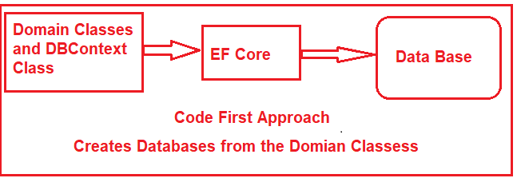
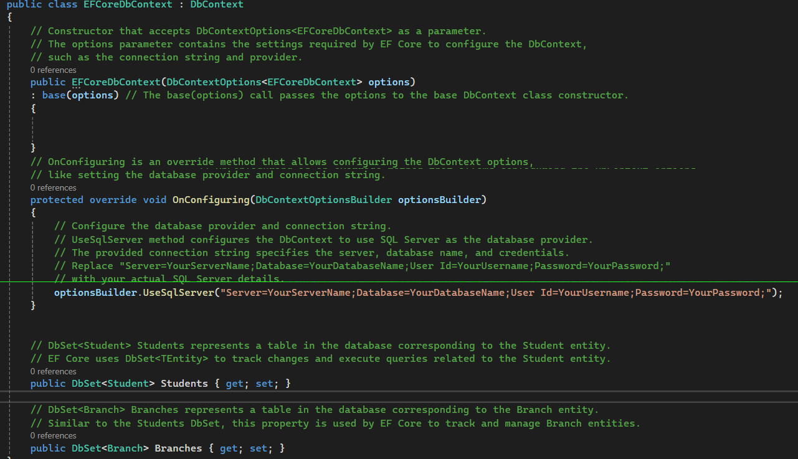
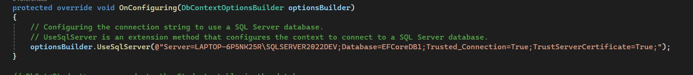

# **EF core**

Entity Framework data access technology.

* **Cross-Platform:** EF Core works on various platforms, including Windows, macOS, and Linux.
* **Code-First Approach:** **In this approach, the data model (classes) is created first, and Entity Framework Core generates the database schema based on the model.
* **Database-First Approach:** **This approach is used when an existing database is available. Entity Framework Core can generate the data model (classes) based on the database schema.

ORM stands for Object-Relational Mapping, a programming technique that allows developers to convert data between incompatible systems, specifically between Object-Oriented Programming Languages (such as C#, Java, etc.) and Relational Databases (such as SQL Server, MySQL, Oracle, etc.).

ORM allows developers to work with data in terms of objects rather than tables and columns. That means ORM automatically creates classes based on database tables,

* **Simplifies Data Access:** ORMs abstract the complexities of data access, allowing developers to interact with the database in an object-oriented rather than writing complex SQL queries.
* **Increased Productivity:** Developers can build applications faster by focusing on the application logic rather than data access details

## **EF Core Code First Approach:**

In the EF Core Code First Approach, first, we need to create our application domain classes, such as Student, Branch, Address, etc., and a special class (called DBContext Class) that derives from the Entity Framework Core DbContext class.

## **Package Installation**

The **EF Core DB Provider Package** is necessary because it allows EF Core to interact with the database. EF Core supports multiple databases, and you need to install the corresponding database provider for the database you want to use (e.g., SQL Server, SQLite, PostgreSQL, etc.).

Without the EF Core Database Provider package, **EF Core cannot perform database operations,** as it doesn’t know how to connect and communicate with the backend database.

SQL server - "**Install-Package Microsoft.EntityFrameworkCore.SqlServer**" - database provider

EF core tool package - "**Install-Package Microsoft.EntityFrameworkCore.Tools**"

## **DbContext Class**

The DbContext class is responsible for interacting with the database using the configured database provider

`DbContext` in EF Core acts as a bridge between the application and the database. It tracks entity states, manages queries, and handles data persistence and relationships efficiently.

* **DbContext:** The main class in EF Core for **interacting with the database**. It manages entity objects during runtime and handles database connections.
* **Constructor:** The constructor initializes the DbContext using the options provided, which typically include the database provider and connection string.
* **OnConfiguring Method:** This method configures the DbContext, such as setting the database provider and connection string. It is useful if you don’t provide configuration externally.
* **DbSet `<TEntity>`:** These properties represent collections of entities that EF Core tracks. They correspond to tables in the database, and each entity type (like Student and Branch) maps to a DbSet.

Entity framework core will create two database tables for the above two model classes with the required relationships.

In  **C# and Entity Framework** , an **entity** is simply a  **class that represents data in your application and maps to a table in a database** .

Think of it like this:

* Each **entity class** = a **table** in the database.
* Each **instance of the class** = a **row** in that table.
* Each **property** = a **column** in that table.

##### **Methods Provided by DbContext**

* **Add/Attach/Update/Remove** : Methods for adding, attaching, updating, or removing entities from the context.
* **SaveChanges / SaveChangesAsync:** Persists changes to the database.
* **Find / FindAsync:** Finds an entity by its primary key.
* **Entry:** Provides access to change tracking information for a specific entity.
* **OnConfiguring:** Allows configuring the context options (e.g., connection string) when not using dependency injection.
* **AddRange/ AddRangeAsync:** This function adds a collection of new entities to DbContext with the Added state and starts tracking them. The new entities will be inserted into the database when SaveChanges() or SaveChangesAsync() is called.

##### **Database Connection String**

A database connection string is a string that specifies information about how to connect to a particular database

A typical connection string includes:

* **Server Name:** The name or network address of the database server.
* **Database Name:** The name of the specific database to which to connect.
* **Credentials:** Username and password for authenticating to the database.
* **Other Settings:** Optional parameters like timeout settings, encryption settings, and more.

**Connection String Components:**

* **Server=LAPTOP-6P5NK25R\SQLSERVER2022DEV:** Specifies the database server’s name or network address.
* **Database=EFCoreDB1:** Indicates the name of the database to connect to or create if it doesn’t exist yet.
* **Trusted_Connection=True:** Enables Windows Authentication mode, which uses your Windows credentials to connect to the database.
* **TrustServerCertificate=True:** Instructs the connection to trust the server’s SSL certificate without requiring validation of the certificate’s chain of trust. This is often used in development environments.

##### **Entity Framework Core Migration**

Migrations in EF Core are a mechanism to keep your database schema in sync with your EF Core model. As your application evolves, your data model may change, requiring corresponding changes to the database schema. Migrations help manage these changes over time without losing data or creating inconsistencies.

**Migration - "Add-Migration CreateEFCoreDB1"**

**Update Database** -"**Update-Database**" need to sync our code base with the database using the **Update-Database **command**

The most important point to remember is that whenever we add or modify domain classes or configurations, we need to sync the database with the model using the **Add-Migration** and **Update-Database** commands. Each time we generate the Migration, we need to provide a name that should have been provided earlier

IF the is a change on class / tables / propery/ delete migration is required 

##### LAZY loading

Related data is loaded **only when you access it** in code.

`var students = context.Students.ToList();

`foreach (var s in students)
{
    Console.WriteLine(s.Name);
    Console.WriteLine(s.Branch?.BranchName); // Triggers a new SQL query each time!
}``

##### **EAGER LOADING**

Load the **main entity and all related data** together in  **one query** .

`var students = context.Students .Include(s => s.Branch)  .ToList(); `

`SELECT [s].[Id], [s].[Name], [s].[BranchId],[b].[Id], [b].[BranchName] FROM [Students] `

`AS [s] LEFT JOIN [Branches] AS [b] ON [s].[BranchId] = [b].[Id]; `

##### CRUD OPERATIONS

Four basic operations performed in Database

* **Create:** Inserting new records into a database.
* **Read:** Retrieving data from the database, often referred to as querying.
* **Update:** Modifying existing records in the database.
* **Delete:** Removing records from the database.
