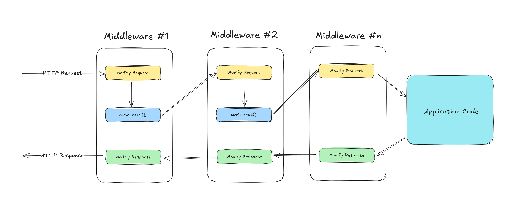

## Middlewares

Middleware is a **software component** in the ASP.NET Core request pipeline that  **processes HTTP requests and responses** .

Each middleware:

1. Receives the request.
2. Executes its own logic.
3. Decides whether to pass the request to the next middleware.
4. Can modify the response on the way back.

//Middleware : :  When a request comes into your application, it passes through this pipeline of middleware components before generating a response.
            //is a check point for the request and response
            // Request → Middleware 1 → Middleware 2 → Middleware 3 → Controller / Endpoint → Middleware 3 → Middleware 2 → Middleware 1 → Response

# When to Use Middleware?

Use middleware when you need logic that should run:

* **Before hitting controllers**
* **For every request**
* **Conditionally based on URL/headers**
* **Globally** , not inside single controller actions

Examples:

* Global exception handling
* Authentication/authorization
* Logging request/response
* Caching
* Rate limiting

When a request enters the application, it flows through the middleware pipeline in the order they are registered. Each middleware component has the option to process the request, make changes to it, or pass it along to the next middleware in line. If needed, middleware can also generate a response immediately, effectively short-circuiting the pipeline and preventing further execution of other middleware components.

## How Middlewares Work?

Each middleware in the pipeline follows a simple pattern: it receives the HttpContext, performs some processing, and then either calls the next middleware or short-circuits the pipeline by generating a response immediately

When a request enters the pipeline, it flows through each middleware  **in the order they are registered** . If a middleware calls `await next()`, the request continues to the next middleware
